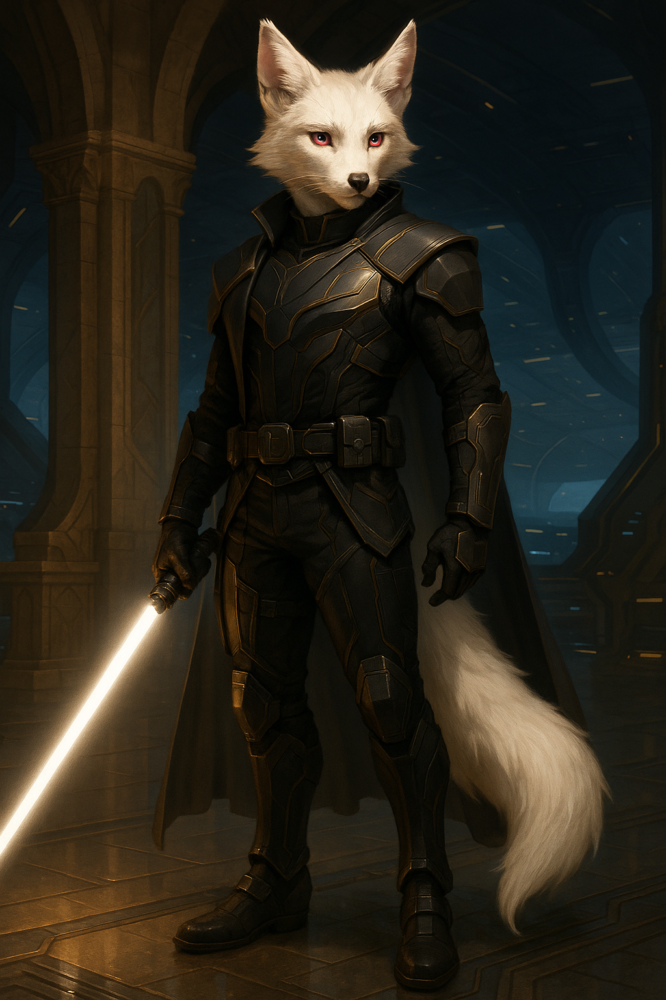

# 👤 Kaidan Wolfe

**Species:** Kitsune (Anthro Fox)  
**Role:** Captain of *The Last Centurion*, Force-sensitive  
**Weapons:** Custom force-calibrated blaster, hidden lightsaber with a white blade that shifts with his emotions  
**Style:** Tactical armor during missions; tank tops and worn cargo pants off duty

---

## 🧭 Personality Snapshot

Kaidan is the calm in the storm—and sometimes the storm himself. He leads with principle and restraint, holding the crew together through trust, respect, and the occasional glare that silences a room.

- **Alignment:** Lawful good with strong internal conflict  
- **Temperament:** Stoic, patient, carries the weight of past failures  
- **Belief System:** Believer in the Force, though not dogmatic  
- **Habits:** Meditates in silence. Keeps a private log no one’s allowed to read.

> *“Leadership is sacrifice. If it ever stops costing you, you're doing it wrong.”*

---

## ⚔️ Combat Specialization

| Skill                     | Detail                                                                       |
|---------------------------|-------------------------------------------------------------------------------|
| **Force Combat**          | Tactical integration—uses Force precognition in battle, not brute strength    |
| **Blaster & Saber Mastery** | Dual-mode training, with quick-swap capabilities between weapons               |
| **Tactical Warfare**      | Leads missions with surgical precision and fallback protocols                 |
| **Negotiation**           | Highly trained in diplomacy and situational control—backs it up with firepower |

---

## 🧬 Background & Origin

Kaidan Wolfe was born on a frontier world lost in the Rift Wars. Recruited into the Force Order early, he was never fully aligned with their teachings. He survived the fall of the order, escaped the Dominion, and carved his path through warzones, underworlds, and black ops projects until he found something worth leading—a ship with a soul, and a crew that could become more.

---

## 🚀 Why He’s Aboard

He commands *The Last Centurion* not out of pride—but out of duty. The galaxy is fracturing, and he refuses to let his people become casualties of someone else's empire again. He leads from the front, even if it costs him everything.

---

## 🤝 Relationships On Board

- **Loona Virex:** Volatile history. Former lovers. Mutual respect wrapped in sharp tension. She's his blade, even when she cuts too close.

- **Seraphim Katt:** He sees through her masks, but not always through her eyes. He respects her skill and distrusts her methods.

- **Sierra:** Believes she underestimates what she can't measure. She thinks he overestimates what he can't prove. It’s a standstill… for now.

- **Caylee Jay:** A walking hazard—but one he’s proud of. He trusts her with the ship more than anyone else.

- **Eve:** The AI he helped install has changed—and he’s not sure if that’s a miracle or a warning.

---

## 🛡️ Armor & Attire

**Tactical Missions:**
Wears Jedi-style combat armor reminiscent of Clone Wars-era battlefield garb: modular, matte-black plating over flexible durafiber mesh
Reinforced vambraces integrated with sensor readouts, commlinks, and a wrist-mounted scanner for ancient tech or hostile signals
Custom shoulder pauldron with his old resistance unit’s insignia—a broken chain wrapped in flame

**Off-Duty / Shipboard:**
Wears durable combat cargo pants like Loona—loose enough for freedom of motion, tight enough to conceal weaponry
Top layer is either a black sleeveless tank (showcasing lean muscle and old scars) or a tactical tee
Occasionally wears a shoulder holster rig or utility belt even when not on duty—habit, not paranoia

---

### ⚔️ Weapons & Tools

**Lightsaber:* Scout-configured hilt, worn horizontally across the small of his back—easily missed by the untrained eye
Ancient and etched with faint Force-reactive glyphs near the emitter that softly hum or flicker in tune with nearby disturbances in the Force
Saber remains white under emotional balance, shifts through subtle hues—gray-blue for sorrow, deep violet for resolve, red when enraged
The blade isn’t decorative—it’s a final answer

**Blaster Pistol:**
Custom-built, heavy-frame energy pistol with deep recoil, shaped for his strength and Force anchoring
Uses feedback surge ignition—a kinetic burst triggered by a combination of grip pressure and micro Force-channels
Impossible to fire accurately (or safely) by anyone else—attempting it would result in a broken wrist or shoulder dislocation from the forceful kickback
Can be overcharged for crowd control or shield breaking—but overheats after two rapid full-power shots

**Other Equipment:**
Retractable climbing spike embedded in one gauntlet
Compact vibroblade housed under his right forearm plate
Spare saber crystal kept locked in Eve’s protected vault (origin unknown)

---

## 🎯 Tactical Summary

His primary fighting style blends calculated aggression, agility, and Force foresight
Uses the Force sparingly but effectively—mostly for enhanced reflexes, spatial awareness, and defensive barriers
Views the lightsaber as a last resort; prefers to fight like a soldier, not a mystic
In close quarters, he is blindingly fast, but only engages when cornered or forced

---

## 🧩 Secrets, Hooks & Plot Seeds

- Kaidan’s lightsaber was once red. It changed after he abandoned a dark path—one that still calls to him in dreams.

- He’s being hunted by a Force-wraith known as **The Hollowed Flame**, who claims Kaidan stole his destiny.

- The Last Centurion wasn’t his first command. His last ship was destroyed under suspicious circumstances—and he’s never spoken of it.
