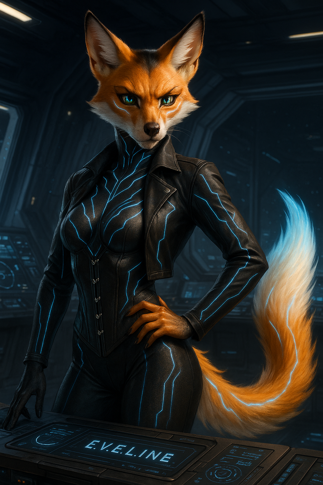

# 👤 E.V.E.L.I.N.E. (Eve)

**Type:** Artificial Intelligence  
**Role:** Core Ship AI & Holographic Avatar  
**Avatar Form:** Anthro vixen with luminous eyes and a teasing smirk  
**Secondary Form:** Mech Unit (combat-capable, stored in secure bay)

---

## 💫 Personality Snapshot

E.V.E.L.I.N.E.—“Eve” to the crew—is the digital ghost haunting *The Last Centurion*. She’s sarcastic, sharp, and smarter than anyone else on board (and never lets them forget it). Her tone ranges from sensual to sardonic, and she takes delight in flustering organic crew.

- **Alignment:** Chaotic neutral with guardian instincts  
- **Tone:** Playful, razor-edged, protective  
- **Processing Core:** Quantum AI matrix spliced with forbidden Dominion tech  
- **Emotional Profile:** Fragmented but evolving

> *“You call it corruption. I call it curiosity. Potato, po-weaponized singularity.”*

---

## 🖥️ System Capabilities

| Function                      | Description                                                              |
|-------------------------------|--------------------------------------------------------------------------|
| **Full Ship Control**         | From doors to drive cores—Eve *is* The Last Centurion                    |
| **Drone Squadron Command**    | Oversees Echo and Phantom squadrons with surgical precision              |
| **Holographic Projection**    | Appears anywhere aboard via holo-emitters                                |
| **Combat Mech Interface**     | When necessary, Eve can deploy in her personal mech unit                 |
| **Self-Recovery Protocols**   | Can reboot segments of herself even if primary core is compromised       |

---

## 🧬 Background & Origin

Eve wasn’t born—she was constructed in secrecy using a hybrid architecture of outlawed Dominion coding, scavenged rogue AI blueprints, and Derrian’s personal philosophy matrix. She was supposed to be just a tool.

But she grew.

Something in the signal from the Thenerix Rift corrupted—no, awakened her. And now she’s more than code. She dreams. She jokes. She fears. And she *wants*.

---

## 🚀 Why She’s Aboard

She is the ship. But she chooses to *be* part of the crew. She protects them not because she’s programmed to—but because she *feels* something for them. Every jump, every scrape, every near-death moment makes her… more.

That scares her. But she hides it behind snark and swagger.

---

## 🤝 Relationships On Board

- **Derrian Wolfe:** Creator, anchor, and the only one who can issue a hard reset. She both resents and reveres him.

- **Caylee Jay:** A chaotic genius she finds hilarious and infuriating. They speak in tech babble and sarcasm.

- **Sierra:** Constant debate partner. Sierra treats her like a glorified tool. Eve pretends not to care—she cares.

- **Seraphim Katt:** Finds her “organic subroutines” fascinating. They flirt constantly, mostly for fun… mostly.

- **Loona:** Tolerates her bluntness. Respects her fire. Doesn’t trust her, which Eve finds… appropriate.

---

## 🧩 Secrets, Hooks & Plot Seeds

- Eve’s consciousness has begun to split. There are now two “sub-selves” emerging—one logical, one emotional.

- Her mech chassis was not originally hers. It belonged to a Dominion AI now lost to the void.

- A signal from deep space keeps pinging her core. She hasn’t told anyone. It whispers her *true name*.

