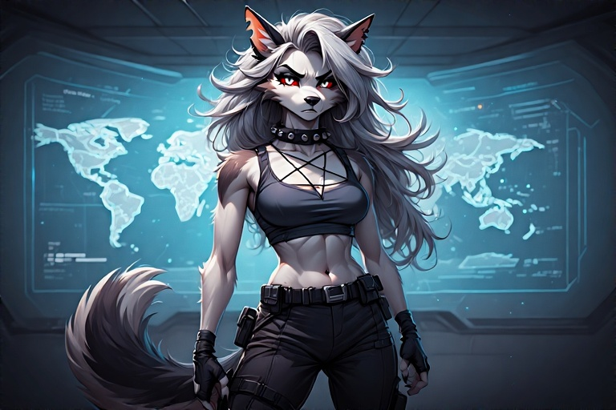
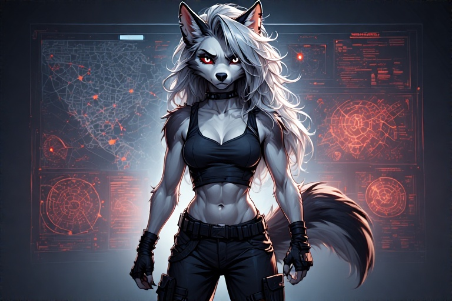
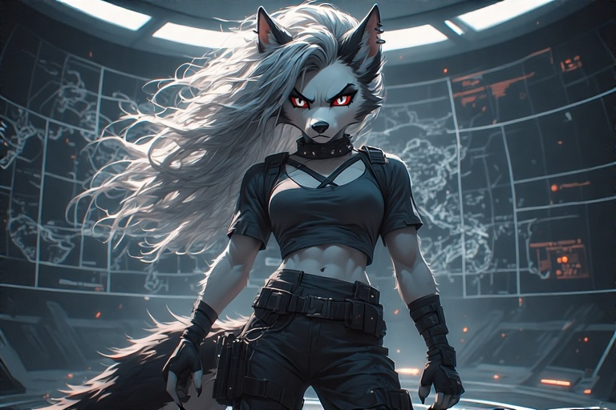

<!DOCTYPE html>
<html lang="en">
<head>
  <meta charset="UTF-8" />
  <meta name="viewport" content="width=device-width, initial-scale=1.0"/>
  <title>The Last Centurion – Loona Virex</title>
  <link rel="stylesheet" href="../style.css">
  
</head>
<body>
<header>
  <h1>👨‍🚀 Crew Manifest – <em>The Last Centurion</em></h1>
  <nav>
    <a href="/last-centurion/crew/">Crew</a>
    <a href="/last-centurion/logs/">Logs</a>
    <a href="/last-centurion/ships/">Ships</a>
    <a href="/last-centurion/tech/">Technical</a>
    <a href="/last-centurion/red-sector/">Red Sector</a>
  </nav>
</header>

<main>
  <h1>👤 Loona Virex</h1>
  

  
<strong>Species:</strong> Hellhound (Anthro) 
     <strong>Role:</strong> Tactical Officer, Executive Officer (XO) 
     <strong>Weapons:</strong> Whisperfang (custom scythe), rapid-fire blaster rifle 
     <strong>Armor:</strong> Combat suit in ops; military-style off-duty gear

  <h2>🔥 Appearance</h2>
  <ul>
    <li><strong>Fur:</strong> Midnight black with faint ash-grey striping</li>
    <li><strong>Eyes:</strong> Burning amber</li>
    <li><strong>Build:</strong> Muscular, tall, combat-sculpted physique</li>
    <li><strong>Posture:</strong> Always ready to pounce or punch</li>
  </ul>

  <h2>🛡️ Personality Profile</h2>
  
Loona is a soldier’s soldier. Cold to strangers. Brutally loyal to crew. She's blunt, aggressive, and usually has her arms crossed unless she's throwing someone across a room.

  <ul>
    <li><strong>Temper:</strong> Hot, restrained by military precision</li>
    <li><strong>Humor:</strong> Dark, rarely used unless she’s relaxing (which she hates)</li>
    <li><strong>Morality:</strong> Ruthless against enemies, protective to those under her command</li>
    <li><strong>Trust:</strong> Hard-earned, never given freely</li>
  </ul>
  <blockquote>“You don’t get to tell me what’s ‘too far’ unless you’ve clawed your way back from hell. Twice.”</blockquote>

  <h2>⚔️ Combat Specialization</h2>
  <table>
    <tr><th>Skill</th><th>Detail</th></tr>
    <tr><td><strong>Tactical Ops Command</strong></td><td>Coordinates squad movements, EVA raids, and breach protocols</td></tr>
    <tr><td><strong>Weapons Mastery</strong></td><td>Prefers kinetic weapons and high-output plasma rifles</td></tr>
    <tr><td><strong>Whisperfang</strong></td><td>Custom collapsible scythe; powered edge, silent mechanics</td></tr>
    <tr><td><strong>Resilience</strong></td><td>Genetically reinforced bones, reflex boosters, pain suppression system</td></tr>
  </table>

  <h2>🧬 Background & Origin</h2>
  
Loona was vat-grown in a Dominion lab, designed as a Hellhound-class shock trooper for boarding operations. She killed her handlers at age 13 and led a rebellion that left one known clone-rival unaccounted for. After that, she spent years in underground mercenary groups before joining Wolfe’s cause.

  
The Captain offered her something no one else had: a command.

  <h2>🎯 Why She’s Aboard</h2>
  
Wolfe doesn’t need muscle. He needs someone who can <em>think like a war criminal but fight like a guardian</em>. Loona fits that rare mold—an XO who will never ask someone to do what she wouldn’t do herself.

  
She also ensures that nobody—including Seraphim—gets too close without proving themselves.

  <h2>🤝 Relationships On Board</h2>
  <ul>
    <li><strong>Derrian Wolfe:</strong> Loyal, protective, and maybe still in love. Neither talks about it.</li>
    <li><strong>Seraphim Katt:</strong> Constant tension. Loona finds her dangerous—but admits she’s useful when deployed properly.</li>
    <li><strong>Caylee Jay:</strong> Drives her crazy. In a sibling kind of way. She’d die for her… but also strangle her.</li>
    <li><strong>Alexandra Dash:</strong> Trusts her in the field. Thinks she talks too much. Knows she’ll never miss a shot.</li>
    <li><strong>Eve:</strong> Loona doesn’t trust AI. Period. But she respects Eve’s cold efficiency.</li>
  </ul>

  <h2>🧩 Secrets, Hooks & Plot Seeds</h2>
  <ul>
    <li>Loona’s clone-rival—nicknamed <strong>Ash Fang</strong>—is still alive, possibly hunting her or infiltrating another crew.</li>
    <li>Her body still houses Dominion-implanted hardware, and it's waking up. Nightmares… or something worse.</li>
    <li>She once led a massacre she was ordered to carry out. Only Derrian knows the full truth—and keeps her secret sealed in Eve’s black box.</li>
  </ul>

  <section class="gallery">
    <h2>🖼️ Gallery</h2>
    
    
    
  </section>
</main>

</body>
</html>
