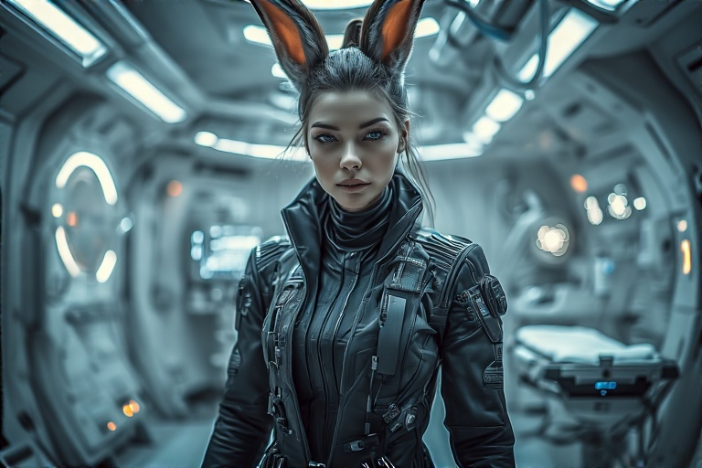

# 👤 Vahlia "Veyla" Saryn

**Species:** Elf-like (psychic prodigy)  
**Role:** Nurse, Seer, Medical Empath  
**Appearance:** Petite and graceful, glowing teal eyes, wears a minimalist uniform lined with neural feedback nodes  
**Style:** Always barefoot aboard ship, often surrounded by low-light ambient auras when in deep diagnostic mode

---

## 🌙 Personality Snapshot

Veyla speaks softly, sees deeply, and rarely smiles unless she means it. She feels the pain of others—literally—and channels that into healing, visions, and protection. While outwardly calm, she carries the constant weight of foresight.

- **Alignment:** Neutral good  
- **Tone:** Gentle, intense, occasionally cryptic  
- **Psychic Profile:** Touch-based diagnostic empathy, precognitive spikes  
- **Mental Health:** Monitored closely by Sierra, due to bleedover from crew trauma

> *“The wound isn’t always where the blood spills. Sometimes it’s where the silence grows.”*

---

## 🧠 Abilities & Skills

| Ability                    | Detail                                                                 |
|----------------------------|-------------------------------------------------------------------------|
| **Empathic Diagnosis**     | Can touch a patient and “feel” what’s wrong, including non-physical causes |
| **Precognitive Bursts**    | Short flashes of near-future probability under stress                   |
| **Surgical Support**       | Enhances Sierra’s precision with realtime emotional-biological feedback |
| **Dream Echo Mapping**     | Sometimes walks through others’ dreams in her sleep—accidentally         |

---

## 🧬 Background & Origin

Born in the same enclave as her sister Sierra, Vahlia was identified early as a psychic anomaly. Dominion agents tried to claim her for experimentation; Sierra risked everything to flee with her. Since then, Veyla has lived in near-constant shielding—both physical and psychic.

She’s chosen to remain on *The Last Centurion* because, for once, the future isn’t just something to fear—it’s something to protect.

---

## 🚀 Why She’s Aboard

She stabilizes the crew not just medically, but emotionally. She brings foresight, comfort, and a strange kind of sacred presence to the ship. Veyla might not carry weapons, but every member of the crew would go to war to defend her.

---

## 🤝 Relationships On Board

- **Sierra:** Her older sister, protector, and only anchor in the darkest storms.

- **Kaiden Wolfe:** She trusts his presence—his Force harmonizes strangely with her gifts.

- **Eve:** They don’t speak often… but Veyla *knows* when Eve is near, and Eve has begun to ask her questions no AI should know to ask.

- **Caylee Jay:** They’re friends, in a weird misfit way. Caylee built her a music cube that adapts to her neural rhythms.

- **Seraphim Katt:** Veyla once read something in her past that made her cry. She’s never told Seraphim what it was.

---

## 🧩 Secrets, Hooks & Plot Seeds

- Veyla’s empathy is beginning to reach beyond the ship—she dreams of strangers, of events not yet triggered.

- Dominion psionic trackers are still trying to locate her; her aura occasionally pings hidden satellites.

- She may not be just psychic—there are signs she’s connected to *something older*, buried deep in Riftspace.

