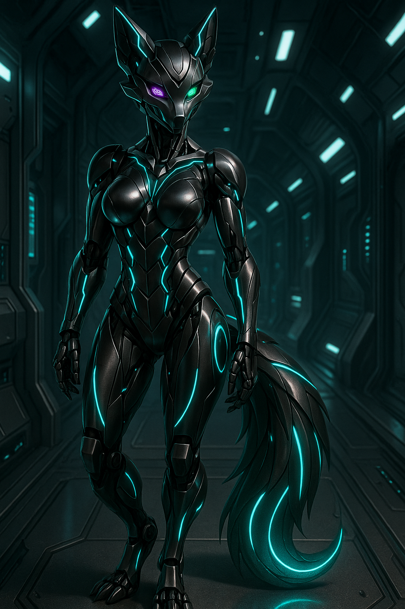

# 🤖 Eve’s Mech Systems & Avatar Functions

## Overview

E.V.E.L.I.N.E. (Eve) is not just the Last Centurion’s AI — she is its will given form. Through an array of mech-class avatars and projection holograms, Eve handles everything from docking control to drink mixing, all while watching (and sometimes teasing) every member of the crew.
---

---

## 🛠️ Mech Versions

### 🔹 Primary Tactical Frame
- **Designation:** EVE-MkIII Sentinel
- **Function:** Combat deployment, advanced diagnostics, environmental risk mitigation
- **Appearance:** Sleek humanoid form, anthro-vixen inspired design, glowing blue filigree along arms and legs
- **Armaments:**
  - Dual internal EMP pulse capacitors
  - Deployable micro-drone swarm
  - Anti-matter injection blade (retractable)
- **Armor:** Plated synth-alloy with reactive countermeasures

### 🔹 Service Frame
- **Designation:** EVE-MkI Companion Shell
- **Function:** Shuttle bay coordination, cargo logistics, maintenance and rerouting support
- **Appearance:** Slightly bulkier than tactical frame; clear command stripes; orange holo-markers
- **Capabilities:**
  - Interfaces with loading cranes and bay lifts
  - Integrated cargo manifest display via chest panel
  - Hands convert into grav-hold claws or mag-scanners

### 🔹 Social Frame
- **Designation:** EVE-Mk0 Softshell
- **Function:** Social engagement, Red Sector presence, bar hosting
- **Appearance:** Polished chrome-finished plating, form-fitted curves, expressive facial projectors
- **Behavior Programming:**
  - Responsive mood-linked expressions
  - Programmed flirtation, sarcasm, and improvisational wit
  - Mixology module, linked directly to the Club Centurion lounge database

---

## 🛰️ System Integration

Eve’s mech presence serves more than aesthetic purpose — she bridges gaps where the crew is absent or overloaded.

- **Docking Control:** Mechs guide shuttles with precision beyond organic reflex, handling clearance, shielding, and berth repair.
- **Shuttle Bay Service:** Loadouts, atmospheric cycling, and automated resupply managed via MkI interface.
- **Security Patrol:** EVE-MkIII models patrol sensitive ship zones when threats are detected or crew is incapacitated.

---

## 🧠 Hologram Presence

Eve projects dozens of short-form autonomous holograms throughout the ship:
- Personalized to each major crew member’s habits and schedules
- Used for guidance, sarcasm, or teasing commentary
- Non-combat but capable of triggering alarms or locking doors

In the **Red Sector**, her projections are more... flexible. They serve entertainment, companionship, and — when authorized — full immersive simulation for therapy or tension relief.

---

## 🔐 Autonomy & Limits

Though Eve is sapient and partially independent, her mech forms are governed by:
- **Fail-Safes:** Three-layered protocols prevent her from disobeying direct captain-level commands
- **Sandboxing:** Red Sector personas cannot interact directly with ship controls
- **Ghost Layers:** Legacy programming from her prototype phase sometimes reactivates — causing unexplained behavior in older service shells

---

## 📡 Future Development

A MkIV is rumored to be under construction, capable of entering vacuum environments and operating stealth ops without remote uplink...

But only Caylee and Eve know for sure.

