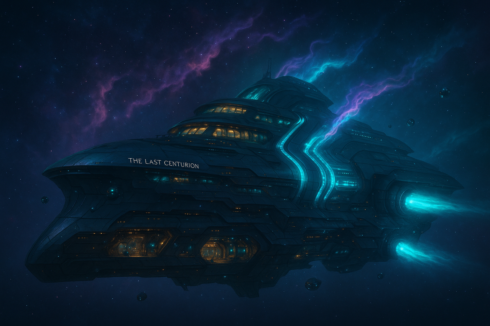

# 🛸 The Last Centurion

> A capital-class cruiser wrapped in sleek opulence and driven by secrets. It serves as home, weapon, and sanctuary for a crew stitched together by fate.

---

## 🧬 Specifications

- **Class:** Capital-class luxury cruiser (heavily modified)
- **Drive:** Jump Drive (instant FTL system-to-system), Sublight thrusters
- **Core AI:** E.V.E.L.I.N.E. (Eve) – fully integrated, semi-autonomous ship intelligence
- **Bridge Location:** Forward-top crescent, encased in layered shielding
- **Power Core:** Quantum-fused fusion chamber with triple redundancy

---

## 🗺️ Deck Layout

### Command Deck
- Bridge, Captain’s quarters, XO’s station
- Navigation, helm, long-range sensors

### Core Deck
- Crew quarters: Fully customizable and uniquely themed
- Mess, lounge, bar, and Club Centurion (Red Sector-adjacent)

### Engineering Bay
- Primary and backup reactors
- Machine shops, diagnostic hubs, Caylee’s private tech cave

### Medbay
- Surgical suites, regeneration pods, and empathic care chambers (run by Veyla & Sileya)
- Secure isolation wing and Rift-reactive containment field

### AI Core Chamber
- Massive crystalline processor core housing Eve’s true form
- Shielded, force-dampened, only accessible to select crew

### Flight Bays
- Two main hangars, fully air-shielded
- Launch tubes for Skull, Fox, Echo, and Phantom squadrons
- Support for VTOL, drone control, and stealth reentry

---

## 🧩 Shipboard Culture

- **Club Centurion:** Lounge/bar/pleasure deck run partly by Eve’s social avatars. NSFW-rated simulations, stress therapy, and camaraderie
- **Recreation Lounges:** Holo-chambers, sparring gyms, story booths
- **Crew Rituals:** Morning drills led by Loona, late-night poker hosted by Dash, dream journaling among the Rift-touched

---

## 🛠️ Capabilities

| System | Description |
|--------|-------------|
| **Jump Drive** | Instant system-to-system travel; limited by cooldown and power rebalancing |
| **Sublight Thrusters** | Intra-system navigation and orbital precision |
| **Cloaking Veil** | Limited-use stealth coating (must drop shields) |
| **Integrated AI** | Eve can control turrets, life support, flight, and communications solo |
| **Hardlight Defense Grid** | Emits physical barrier plates at key hull sectors when shields fall |

---

## 🛡️ Defense & Armament

- Forward-mounted railcannon array (Skull-tier impact)
- Retractable missile batteries beneath ventral flaps
- Point-defense laser turrets for intercepting fighters or warheads
- Drone swarm pods controlled by Eve

---

## 🧠 Hidden Systems

- **Thenerix Tech:** Precursor interfaces partially reverse-engineered from ruins — only functional via Eve
- **Rift-Sensitive Chambers:** Located below medbay, used by Sileya to map anomalies in space-time
- **Locked Deck 7:** Permanently sealed. No one remembers what's behind it. Eve won’t talk about it.

---

## 🎯 Purpose

The Last Centurion is more than a ship. It’s a last stand against creeping tyranny — a sanctuary for the misfit, the broken, and the dangerous. And sometimes... it dreams.
